# Shotgrid Publisher - Project Structure

## Directory Structure

```
shotgrid-publisher/
├── src/
│   ├── __init__.py
│   ├── main.py                      # Application entry point
│   │
│   ├── config/
│   │   ├── __init__.py
│   │   ├── settings.py              # Application settings
│   │   └── shotgrid_config.py       # Shotgrid connection config (non-sensitive)
│   │
│   ├── core/
│   │   ├── __init__.py
│   │   ├── shotgrid_manager.py      # Shotgrid API wrapper (base layer)
│   │   ├── base_manager.py          # Base class for specialized managers
│   │   ├── auth_manager.py          # Authentication handler
│   │   ├── crypto_manager.py        # Encryption/decryption utilities
│   │   │
│   │   └── managers/
│   │       ├── __init__.py
│   │       ├── publish_manager.py   # Publish operations
│   │       ├── project_manager.py   # Project operations
│   │       ├── entity_manager.py    # Generic entity operations (Shots, Assets)
│   │       └── task_manager.py      # Task operations
│   │
│   ├── ui/
│   │   ├── __init__.py
│   │   ├── main_window.py           # Main application window
│   │   │
│   │   ├── dialogs/
│   │   │   ├── __init__.py
│   │   │   ├── login_dialog.py      # Login/authentication dialog
│   │   │   └── publish_dialog.py    # Publish configuration dialog
│   │   │
│   │   ├── widgets/
│   │   │   ├── __init__.py
│   │   │   ├── file_browser.py      # File selection widget
│   │   │   ├── publish_list.py      # Publish history widget
│   │   │   └── entity_browser.py    # Entity selection widget
│   │   │
│   │   └── resources/
│   │       ├── icons/               # Application icons
│   │       │   ├── app.ico          # Windows icon
│   │       │   ├── app.icns         # macOS icon
│   │       │   └── app.png          # Linux icon
│   │       ├── styles/              # QSS stylesheets
│   │       │   └── main.qss
│   │       └── resources.qrc        # Qt resource file
│   │
│   └── utils/
│       ├── __init__.py
│       ├── logger.py                # Logging configuration
│       ├── validators.py            # Input/file validation
│       └── file_handler.py          # File operations utilities
│
├── tests/
│   ├── __init__.py
│   ├── conftest.py                  # Pytest configuration
│   ├── test_shotgrid_manager.py
│   ├── test_auth_manager.py
│   ├── test_crypto_manager.py
│   └── test_publish_manager.py
│
├── build/
│   ├── build_windows.py             # Windows build script
│   ├── build_linux.py               # Linux build script
│   ├── build_macos.py               # macOS build script
│   ├── build_all.py                 # Auto-detect platform and build
│   ├── configure_credentials.py     # Admin tool for credential setup
│   │
│   └── hooks/                       # PyInstaller hooks
│       ├── hook-shotgun_api3.py
│       └── hook-PySide6.py
│
├── dist/                            # Build output (gitignored)
│   ├── windows/
│   ├── linux/
│   └── macos/
│
├── docs/
│   ├── README.md                    # Documentation index
│   ├── user_guide.md                # End-user documentation
│   ├── developer_guide.md           # Developer setup guide
│   ├── architecture.md              # Architecture overview
│   ├── api_documentation.md         # API reference
│   │
│   └── diagrams/                    # Mermaid UML diagrams
│       ├── README.md                # How to view diagrams
│       ├── class_diagrams.md        # Class structure
│       ├── sequence_diagrams.md     # Interaction flows
│       ├── state_diagrams.md        # State machines
│       └── component_diagrams.md    # Component relationships
│
├── requirements/
│   ├── base.txt                     # Core dependencies
│   ├── dev.txt                      # Development dependencies
│   └── build.txt                    # Build dependencies
│
├── .github/
│   └── workflows/
│       └── build.yml                # GitHub Actions CI/CD
│
├── environment.yml                  # Base conda environment
├── environment-windows.yml          # Windows-specific
├── environment-linux.yml            # Linux-specific
├── environment-macos.yml            # macOS-specific
│
├── .env.example                     # Example environment variables
├── .gitignore
├── README.md
├── LICENSE
├── CHANGELOG.md
└── pyproject.toml                   # Project metadata
```

## Architecture Overview

### Layer Structure (Composition Pattern)

```
┌─────────────────────────────────────────────────────────────┐
│                    UI Layer (PySide6)                       │
│           main_window.py, dialogs, widgets                  │
└────────────────────────────┬────────────────────────────────┘
                             │
┌────────────────────────────▼────────────────────────────────┐
│              Specialized Managers Layer                     │
│                  (Composition Pattern)                      │
│                                                             │
│  BaseManager ← PublishManager                              │
│  (utilities)   ProjectManager                              │
│                EntityManager                               │
│                TaskManager                                 │
│                                                             │
│  All inject same ShotgridManager instance via __init__     │
└────────────────────────────┬────────────────────────────────┘
                             │
┌────────────────────────────▼────────────────────────────────┐
│           ShotgridManager (API Wrapper)                     │
│  • Wraps shotgun_api3.Shotgun                              │
│  • Connection management                                    │
│  • Generic CRUD operations                                  │
│  • Error handling & retries                                 │
└────────────────────────────┬────────────────────────────────┘
                             │
┌────────────────────────────▼────────────────────────────────┐
│              shotgun_api3.Shotgun                          │
│              (Autodesk Official SDK)                        │
└─────────────────────────────────────────────────────────────┘
```

### Key Design Decisions

**✅ Composition over Inheritance**
- All specialized managers receive ShotgridManager via dependency injection
- Single shared connection across all managers
- Easy to mock for testing

**✅ Encrypted Credentials**
- Machine-specific encryption using cryptography library
- Credentials never stored in plain text
- Auto-login support

**✅ Self-Contained Builds**
- PyInstaller creates standalone executables
- Embedded Python interpreter and all dependencies
- No installation required for end users

---

## Requirements Files

### `requirements/base.txt`
```txt
# Core application dependencies
shotgun-api3>=3.3.0
PySide6>=6.6.0
python-dotenv>=1.0.0
requests>=2.31.0
cryptography>=41.0.0
```

### `requirements/dev.txt`
```txt
# Development dependencies
-r base.txt

# Testing
pytest>=7.4.0
pytest-cov>=4.1.0
pytest-mock>=3.11.0
pytest-qt>=4.2.0

# Code quality
black>=23.0.0
flake8>=6.0.0
mypy>=1.5.0
pylint>=2.17.0

# Documentation
sphinx>=7.0.0
sphinx-rtd-theme>=1.3.0
myst-parser>=2.0.0          # Markdown support for Sphinx
sphinxcontrib-mermaid>=0.9.2 # Mermaid diagram support
```

### `requirements/build.txt`
```txt
# Build dependencies
-r base.txt
pyinstaller>=6.0.0
```

---

## Conda Environment Files

### `environment.yml` (Base - Cross-platform)
```yaml
name: shotgrid-publisher
channels:
  - conda-forge
  - defaults
dependencies:
  - python=3.11
  - pip
  - pip:
    - shotgun-api3>=3.3.0
    - PySide6>=6.6.0
    - python-dotenv>=1.0.0
    - requests>=2.31.0
    - pyinstaller>=6.0.0
    - cryptography>=41.0.0
```

### `environment-windows.yml`
```yaml
name: shotgrid-publisher
channels:
  - conda-forge
  - defaults
dependencies:
  - python=3.11
  - pip
  - pip:
    - shotgun-api3>=3.3.0
    - PySide6>=6.6.0
    - python-dotenv>=1.0.0
    - requests>=2.31.0
    - pyinstaller>=6.0.0
    - cryptography>=41.0.0
    - pywin32>=305  # Windows-specific
```

### `environment-linux.yml`
```yaml
name: shotgrid-publisher
channels:
  - conda-forge
  - defaults
dependencies:
  - python=3.11
  - pip
  - libxcb  # Linux GUI support
  - pip:
    - shotgun-api3>=3.3.0
    - PySide6>=6.6.0
    - python-dotenv>=1.0.0
    - requests>=2.31.0
    - pyinstaller>=6.0.0
    - cryptography>=41.0.0
```

### `environment-macos.yml`
```yaml
name: shotgrid-publisher
channels:
  - conda-forge
  - defaults
dependencies:
  - python=3.11
  - pip
  - pip:
    - shotgun-api3>=3.3.0
    - PySide6>=6.6.0
    - python-dotenv>=1.0.0
    - requests>=2.31.0
    - pyinstaller>=6.0.0
    - cryptography>=41.0.0
    - pyobjc-framework-Cocoa>=9.0  # macOS-specific
```

---

## Build Scripts

### `build/build_windows.py`
```python
"""
Windows Build Script
Creates standalone .exe for Windows
"""
import PyInstaller.__main__
import os
import sys
import platform

def build_windows():
    """Build standalone executable for Windows"""
    
    if platform.system() != 'Windows':
        print("⚠️  Warning: Building for Windows on non-Windows system")
        print("   For best results, build on the target platform.")
        print()
    
    project_root = os.path.dirname(os.path.dirname(os.path.abspath(__file__)))
    src_path = os.path.join(project_root, 'src')
    
    # Add src to Python path
    sys.path.insert(0, src_path)
    
    args = [
        os.path.join(src_path, 'main.py'),
        
        # Basic options
        '--name=ShotgridPublisher',
        '--windowed',  # No console window
        '--onefile',   # Single executable
        
        # Icon
        f'--icon={os.path.join(src_path, "ui/resources/icons/app.ico")}',
        
        # Add data files (use ; on Windows, : on Unix)
        f'--add-data={os.path.join(src_path, "ui/resources")}{os.pathsep}ui/resources',
        
        # Hidden imports
        '--hidden-import=shotgun_api3',
        '--hidden-import=PySide6',
        '--hidden-import=PySide6.QtCore',
        '--hidden-import=PySide6.QtGui',
        '--hidden-import=PySide6.QtWidgets',
        '--hidden-import=cryptography',
        '--hidden-import=cryptography.fernet',
        
        # Windows-specific
        '--hidden-import=win32api',
        '--hidden-import=win32com',
        
        # Paths
        f'--distpath={os.path.join(project_root, "dist", "windows")}',
        f'--workpath={os.path.join(project_root, "build", "temp", "windows")}',
        f'--specpath={os.path.join(project_root, "build", "specs")}',
        
        # Additional options
        '--clean',
        '--noconfirm',
        
        # Hooks
        f'--additional-hooks-dir={os.path.join(project_root, "build", "hooks")}',
    ]
    
    print("=" * 60)
    print("Building Windows Executable")
    print("=" * 60)
    print(f"Python: {sys.version}")
    print(f"Platform: {platform.platform()}")
    print()
    
    PyInstaller.__main__.run(args)
    
    exe_path = os.path.join(project_root, 'dist', 'windows', 'ShotgridPublisher.exe')
    print()
    print("=" * 60)
    print("✓ Build Complete!")
    print("=" * 60)
    print(f"Executable: {exe_path}")
    print()

if __name__ == '__main__':
    build_windows()
```

### `build/build_linux.py`
```python
"""
Linux Build Script
Creates standalone executable for Linux
"""
import PyInstaller.__main__
import os
import sys
import platform

def build_linux():
    """Build standalone executable for Linux"""
    
    if platform.system() != 'Linux':
        print("⚠️  Warning: Building for Linux on non-Linux system")
        print("   For best results, build on the target platform.")
        print()
    
    project_root = os.path.dirname(os.path.dirname(os.path.abspath(__file__)))
    src_path = os.path.join(project_root, 'src')
    
    sys.path.insert(0, src_path)
    
    args = [
        os.path.join(src_path, 'main.py'),
        
        # Basic options
        '--name=ShotgridPublisher',
        '--windowed',
        '--onefile',
        
        # Icon
        f'--icon={os.path.join(src_path, "ui/resources/icons/app.png")}',
        
        # Add data files (: separator on Unix)
        f'--add-data={os.path.join(src_path, "ui/resources")}:ui/resources',
        
        # Hidden imports
        '--hidden-import=shotgun_api3',
        '--hidden-import=PySide6',
        '--hidden-import=PySide6.QtCore',
        '--hidden-import=PySide6.QtGui',
        '--hidden-import=PySide6.QtWidgets',
        '--hidden-import=PySide6.QtDBus',  # Linux-specific
        '--hidden-import=cryptography',
        
        # Paths
        f'--distpath={os.path.join(project_root, "dist", "linux")}',
        f'--workpath={os.path.join(project_root, "build", "temp", "linux")}',
        f'--specpath={os.path.join(project_root, "build", "specs")}',
        
        # Additional options
        '--clean',
        '--noconfirm',
        
        # Hooks
        f'--additional-hooks-dir={os.path.join(project_root, "build", "hooks")}',
    ]
    
    print("=" * 60)
    print("Building Linux Executable")
    print("=" * 60)
    print(f"Python: {sys.version}")
    print(f"Platform: {platform.platform()}")
    print()
    
    PyInstaller.__main__.run(args)
    
    # Make executable
    exe_path = os.path.join(project_root, 'dist', 'linux', 'ShotgridPublisher')
    os.chmod(exe_path, 0o755)
    
    print()
    print("=" * 60)
    print("✓ Build Complete!")
    print("=" * 60)
    print(f"Executable: {exe_path}")
    print()

if __name__ == '__main__':
    build_linux()
```

### `build/build_macos.py`
```python
"""
macOS Build Script
Creates standalone .app bundle for macOS
"""
import PyInstaller.__main__
import os
import sys
import platform

def build_macos():
    """Build standalone application bundle for macOS"""
    
    if platform.system() != 'Darwin':
        print("⚠️  Warning: Building for macOS on non-macOS system")
        print("   For best results, build on the target platform.")
        print()
    
    project_root = os.path.dirname(os.path.dirname(os.path.abspath(__file__)))
    src_path = os.path.join(project_root, 'src')
    
    sys.path.insert(0, src_path)
    
    args = [
        os.path.join(src_path, 'main.py'),
        
        # Basic options
        '--name=ShotgridPublisher',
        '--windowed',
        '--onefile',
        
        # Icon
        f'--icon={os.path.join(src_path, "ui/resources/icons/app.icns")}',
        
        # Add data files (: separator on Unix)
        f'--add-data={os.path.join(src_path, "ui/resources")}:ui/resources',
        
        # Hidden imports
        '--hidden-import=shotgun_api3',
        '--hidden-import=PySide6',
        '--hidden-import=PySide6.QtCore',
        '--hidden-import=PySide6.QtGui',
        '--hidden-import=PySide6.QtWidgets',
        '--hidden-import=cryptography',
        
        # macOS-specific
        '--osx-bundle-identifier=com.yourstudio.shotgridpublisher',
        
        # Paths
        f'--distpath={os.path.join(project_root, "dist", "macos")}',
        f'--workpath={os.path.join(project_root, "build", "temp", "macos")}',
        f'--specpath={os.path.join(project_root, "build", "specs")}',
        
        # Additional options
        '--clean',
        '--noconfirm',
        
        # Hooks
        f'--additional-hooks-dir={os.path.join(project_root, "build", "hooks")}',
    ]
    
    print("=" * 60)
    print("Building macOS Application Bundle")
    print("=" * 60)
    print(f"Python: {sys.version}")
    print(f"Platform: {platform.platform()}")
    print()
    
    PyInstaller.__main__.run(args)
    
    app_path = os.path.join(project_root, 'dist', 'macos', 'ShotgridPublisher.app')
    
    print()
    print("=" * 60)
    print("✓ Build Complete!")
    print("=" * 60)
    print(f"Application: {app_path}")
    print()
    print("Note: For distribution, consider code signing:")
    print("  codesign --force --deep --sign 'Developer ID' ShotgridPublisher.app")
    print()

if __name__ == '__main__':
    build_macos()
```

### `build/build_all.py`
```python
"""
Unified Build Script
Auto-detects platform and builds accordingly
"""
import platform
import subprocess
import sys
import os

def get_platform():
    """Detect current platform"""
    system = platform.system()
    if system == 'Windows':
        return 'windows'
    elif system == 'Linux':
        return 'linux'
    elif system == 'Darwin':
        return 'macos'
    else:
        raise RuntimeError(f"Unsupported platform: {system}")

def check_conda_env():
    """Check if conda environment is activated"""
    if 'CONDA_DEFAULT_ENV' not in os.environ:
        print("⚠️  Warning: Conda environment may not be activated!")
        print("   Recommended: conda activate shotgrid-publisher")
        print()
        response = input("Continue anyway? (y/N): ")
        if response.lower() != 'y':
            sys.exit(0)

def run_build(platform_name):
    """Run platform-specific build script"""
    build_dir = os.path.dirname(os.path.abspath(__file__))
    script_name = f"build_{platform_name}.py"
    script_path = os.path.join(build_dir, script_name)
    
    print()
    print("=" * 60)
    print(f"Building for {platform_name.upper()}")
    print("=" * 60)
    print()
    
    result = subprocess.run([sys.executable, script_path])
    
    if result.returncode != 0:
        print()
        print(f"✗ Build failed for {platform_name}")
        sys.exit(1)
    
    print()
    print(f"✓ Build successful for {platform_name}")

def main():
    print("=" * 60)
    print("Shotgrid Publisher - Build Script")
    print("=" * 60)
    
    current_platform = get_platform()
    print(f"Detected platform: {current_platform}")
    print(f"Python version: {sys.version}")
    print()
    
    check_conda_env()
    
    run_build(current_platform)
    
    print()
    print("=" * 60)
    print("BUILD COMPLETE!")
    print("=" * 60)
    print()

if __name__ == '__main__':
    main()
```

### `build/hooks/hook-shotgun_api3.py`
```python
"""
PyInstaller hook for shotgun_api3
Ensures all necessary modules are included
"""
from PyInstaller.utils.hooks import collect_all, collect_data_files

# Collect all shotgun_api3 modules and data
datas, binaries, hiddenimports = collect_all('shotgun_api3')

# Add specific hidden imports
hiddenimports += [
    'shotgun_api3.lib',
    'shotgun_api3.lib.httplib2',
    'shotgun_api3.lib.sgtimezone',
]

# Collect any data files
datas += collect_data_files('shotgun_api3')
```

---

## Build Process

### Prerequisites

1. **Install Conda/Miniconda**
   - Download from: https://docs.conda.io/en/latest/miniconda.html

2. **Clone Repository**
   ```bash
   git clone <your-repo-url>
   cd shotgrid-publisher
   ```

### Setup Environment

#### Option 1: Base Environment (Cross-platform)
```bash
# Create environment
conda env create -f environment.yml

# Activate
conda activate shotgrid-publisher
```

#### Option 2: Platform-Specific Environment (Recommended)
```bash
# Windows
conda env create -f environment-windows.yml

# Linux
conda env create -f environment-linux.yml

# macOS
conda env create -f environment-macos.yml

# Then activate
conda activate shotgrid-publisher
```

### Build Instructions

#### Build for Current Platform
```bash
# Ensure environment is activated
conda activate shotgrid-publisher

# Auto-detect and build
python build/build_all.py
```

#### Build for Specific Platform
```bash
# Windows
python build/build_windows.py

# Linux
python build/build_linux.py

# macOS
python build/build_macos.py
```

### Build Output

Executables will be created in:
```
dist/
├── windows/
│   └── ShotgridPublisher.exe
├── linux/
│   └── ShotgridPublisher
└── macos/
    └── ShotgridPublisher.app/
```

### Testing the Build

```bash
# Windows
dist\windows\ShotgridPublisher.exe

# Linux
./dist/linux/ShotgridPublisher

# macOS
open dist/macos/ShotgridPublisher.app
```

---

## GitHub Actions CI/CD

### `.github/workflows/build.yml`
```yaml
name: Build Shotgrid Publisher

on:
  push:
    branches: [ main, develop ]
    tags:
      - 'v*'
  pull_request:
    branches: [ main, develop ]
  workflow_dispatch:

jobs:
  build-windows:
    runs-on: windows-latest
    steps:
      - name: Checkout code
        uses: actions/checkout@v4
      
      - name: Setup Miniconda
        uses: conda-incubator/setup-miniconda@v3
        with:
          auto-update-conda: true
          python-version: '3.11'
          environment-file: environment-windows.yml
          activate-environment: shotgrid-publisher
      
      - name: Build Windows Executable
        shell: bash -el {0}
        run: |
          conda activate shotgrid-publisher
          python build/build_windows.py
      
      - name: Upload Windows Artifact
        uses: actions/upload-artifact@v4
        with:
          name: ShotgridPublisher-Windows
          path: dist/windows/ShotgridPublisher.exe
          retention-days: 30

  build-linux:
    runs-on: ubuntu-latest
    steps:
      - name: Checkout code
        uses: actions/checkout@v4
      
      - name: Setup Miniconda
        uses: conda-incubator/setup-miniconda@v3
        with:
          auto-update-conda: true
          python-version: '3.11'
          environment-file: environment-linux.yml
          activate-environment: shotgrid-publisher
      
      - name: Build Linux Executable
        shell: bash -el {0}
        run: |
          conda activate shotgrid-publisher
          python build/build_linux.py
      
      - name: Upload Linux Artifact
        uses: actions/upload-artifact@v4
        with:
          name: ShotgridPublisher-Linux
          path: dist/linux/ShotgridPublisher
          retention-days: 30

  build-macos:
    runs-on: macos-latest
    steps:
      - name: Checkout code
        uses: actions/checkout@v4
      
      - name: Setup Miniconda
        uses: conda-incubator/setup-miniconda@v3
        with:
          auto-update-conda: true
          python-version: '3.11'
          environment-file: environment-macos.yml
          activate-environment: shotgrid-publisher
      
      - name: Build macOS Application
        shell: bash -el {0}
        run: |
          conda activate shotgrid-publisher
          python build/build_macos.py
      
      - name: Create DMG (Optional)
        shell: bash -el {0}
        run: |
          # Install create-dmg
          brew install create-dmg
          
          # Create DMG
          create-dmg \
            --volname "Shotgrid Publisher" \
            --window-pos 200 120 \
            --window-size 800 400 \
            --icon-size 100 \
            --app-drop-link 600 185 \
            "ShotgridPublisher.dmg" \
            "dist/macos/ShotgridPublisher.app"
      
      - name: Upload macOS Artifact
        uses: actions/upload-artifact@v4
        with:
          name: ShotgridPublisher-macOS
          path: |
            dist/macos/ShotgridPublisher.app
            ShotgridPublisher.dmg
          retention-days: 30

  create-release:
    needs: [build-windows, build-linux, build-macos]
    runs-on: ubuntu-latest
    if: startsWith(github.ref, 'refs/tags/v')
    
    steps:
      - name: Checkout code
        uses: actions/checkout@v4
      
      - name: Download all artifacts
        uses: actions/download-artifact@v4
        with:
          path: artifacts
      
      - name: Create Release
        uses: softprops/action-gh-release@v1
        with:
          files: |
            artifacts/ShotgridPublisher-Windows/ShotgridPublisher.exe
            artifacts/ShotgridPublisher-Linux/ShotgridPublisher
            artifacts/ShotgridPublisher-macOS/ShotgridPublisher.dmg
          draft: false
          prerelease: false
          generate_release_notes: true
        env:
          GITHUB_TOKEN: ${{ secrets.GITHUB_TOKEN }}

  test:
    runs-on: ${{ matrix.os }}
    strategy:
      matrix:
        os: [ubuntu-latest, windows-latest, macos-latest]
    
    steps:
      - name: Checkout code
        uses: actions/checkout@v4
      
      - name: Setup Miniconda
        uses: conda-incubator/setup-miniconda@v3
        with:
          auto-update-conda: true
          python-version: '3.11'
          environment-file: environment.yml
          activate-environment: shotgrid-publisher
      
      - name: Install dev dependencies
        shell: bash -el {0}
        run: |
          conda activate shotgrid-publisher
          pip install -r requirements/dev.txt
      
      - name: Run tests
        shell: bash -el {0}
        run: |
          conda activate shotgrid-publisher
          pytest tests/ -v --cov=src --cov-report=xml
      
      - name: Upload coverage
        uses: codecov/codecov-action@v3
        with:
          file: ./coverage.xml
          fail_ci_if_error: false
```

---

## Additional Files

### `.gitignore`
```
# Python
__pycache__/
*.py[cod]
*$py.class
*.so
.Python
env/
venv/
ENV/
build/
develop-eggs/
dist/
downloads/
eggs/
.eggs/
lib/
lib64/
parts/
sdist/
var/
wheels/
*.egg-info/
.installed.cfg
*.egg

# PyInstaller
*.manifest
*.spec
build/temp/
build/specs/

# Testing
.pytest_cache/
.coverage
htmlcov/
.tox/

# IDEs
.vscode/
.idea/
*.swp
*.swo
*~

# OS
.DS_Store
Thumbs.db

# Environment
.env
.env.local

# Credentials
*.sg_credentials
credentials/

# Logs
*.log
logs/

# Conda
*.conda
.conda/
```

### `.env.example`
```bash
# Shotgrid Connection (for development only - never commit real credentials!)
# In production, use encrypted credential storage

# SG_SERVER_URL=https://your-studio.shotgunstudio.com
# SG_SCRIPT_NAME=your_script_name
# SG_SCRIPT_KEY=your_script_api_key

# Application Settings
LOG_LEVEL=INFO
LOG_FILE=shotgrid_publisher.log
```

### `README.md`
```markdown
# Shotgrid Publisher

A standalone desktop application for publishing files to Autodesk Shotgrid.

## Features

- 🔐 **Secure Encrypted Credentials** - Machine-specific encryption for API keys
- 🖥️ **Cross-Platform** - Windows, Linux, and macOS support
- 📦 **Self-Contained** - No dependencies required for end users
- 🚀 **Easy Publishing** - Streamlined workflow for file publishing
- 📋 **Version Control** - Automatic version management
- 🎨 **Modern UI** - Clean PySide6 interface

## Installation

### For End Users

Download the appropriate executable for your platform:

- **Windows**: `ShotgridPublisher.exe`
- **Linux**: `ShotgridPublisher`
- **macOS**: `ShotgridPublisher.app`

No installation required - just run the executable!

### For Developers

See [Developer Guide](docs/developer_guide.md) for setup instructions.

## Quick Start

1. Launch the application
2. Enter your Shotgrid credentials on first run
3. Select project and entity
4. Choose file(s) to publish
5. Configure publish settings
6. Publish!

## Documentation

- [User Guide](docs/user_guide.md) - End-user documentation
- [Developer Guide](docs/developer_guide.md) - Development setup
- [Architecture](docs/architecture.md) - Technical overview
- [API Documentation](docs/api_documentation.md) - Code reference

## Building from Source

### Prerequisites

- Conda or Miniconda
- Python 3.11

### Setup

```bash
# Clone repository
git clone https://github.com/yourstudio/shotgrid-publisher.git
cd shotgrid-publisher

# Create conda environment
conda env create -f environment.yml
conda activate shotgrid-publisher

# Build for your platform
python build/build_all.py
```

See [Build Instructions](#build-process) for detailed information.

## Support

For issues or questions:
- Open an issue on GitHub
- Contact your studio's pipeline team
- Email: support@yourstudio.com

## License

Copyright © 2024 Your Studio. All rights reserved.

See [LICENSE](LICENSE) for details.
```

### `pyproject.toml`
```toml
[build-system]
requires = ["setuptools>=68.0", "wheel"]
build-backend = "setuptools.build_meta"

[project]
name = "shotgrid-publisher"
version = "1.0.0"
description = "Standalone desktop application for publishing to Shotgrid"
authors = [
    {name = "Your Studio", email = "pipeline@yourstudio.com"}
]
readme = "README.md"
requires-python = ">=3.11"
license = {text = "Proprietary"}
keywords = ["shotgrid", "vfx", "pipeline", "publishing"]
classifiers = [
    "Development Status :: 4 - Beta",
    "Intended Audience :: End Users/Desktop",
    "Programming Language :: Python :: 3.11",
    "Operating System :: OS Independent",
]

dependencies = [
    "shotgun-api3>=3.3.0",
    "PySide6>=6.6.0",
    "python-dotenv>=1.0.0",
    "requests>=2.31.0",
    "cryptography>=41.0.0",
]

[project.optional-dependencies]
dev = [
    "pytest>=7.4.0",
    "pytest-cov>=4.1.0",
    "pytest-mock>=3.11.0",
    "pytest-qt>=4.2.0",
    "black>=23.0.0",
    "flake8>=6.0.0",
    "mypy>=1.5.0",
]

build = [
    "pyinstaller>=6.0.0",
]

[project.urls]
Homepage = "https://github.com/yourstudio/shotgrid-publisher"
Documentation = "https://github.com/yourstudio/shotgrid-publisher/docs"
Repository = "https://github.com/yourstudio/shotgrid-publisher"
Issues = "https://github.com/yourstudio/shotgrid-publisher/issues"

[tool.black]
line-length = 88
target-version = ['py311']
include = '\.pyi?
extend-exclude = '''
/(
  # directories
  \.eggs
  | \.git
  | \.hg
  | \.mypy_cache
  | \.tox
  | \.venv
  | build
  | dist
)/
'''

[tool.pytest.ini_options]
testpaths = ["tests"]
python_files = ["test_*.py"]
python_classes = ["Test*"]
python_functions = ["test_*"]
addopts = [
    "--verbose",
    "--strict-markers",
    "--cov=src",
    "--cov-report=term-missing",
    "--cov-report=html",
]

[tool.mypy]
python_version = "3.11"
warn_return_any = true
warn_unused_configs = true
disallow_untyped_defs = true
ignore_missing_imports = true
```

### `CHANGELOG.md`
```markdown
# Changelog

All notable changes to this project will be documented in this file.

The format is based on [Keep a Changelog](https://keepachangelog.com/en/1.0.0/),
and this project adheres to [Semantic Versioning](https://semver.org/spec/v2.0.0.html).

## [Unreleased]

### Added
- Initial project structure
- Encrypted credential storage
- Basic publish workflow
- Cross-platform builds

### Changed
- N/A

### Deprecated
- N/A

### Removed
- N/A

### Fixed
- N/A

### Security
- Implemented machine-specific encryption for credentials

## [1.0.0] - 2024-XX-XX

### Added
- Initial release
- Shotgrid authentication with encrypted credentials
- File publishing workflow
- Version management
- Windows, Linux, and macOS support
- Self-contained executables with embedded Python

[Unreleased]: https://github.com/yourstudio/shotgrid-publisher/compare/v1.0.0...HEAD
[1.0.0]: https://github.com/yourstudio/shotgrid-publisher/releases/tag/v1.0.0
```

---

## Development Workflow

### Initial Setup

```bash
# 1. Clone repository
git clone https://github.com/yourstudio/shotgrid-publisher.git
cd shotgrid-publisher

# 2. Create conda environment
conda env create -f environment.yml
conda activate shotgrid-publisher

# 3. Install development dependencies
pip install -r requirements/dev.txt

# 4. Configure environment (optional for development)
cp .env.example .env
# Edit .env with your test credentials
```

### Running in Development Mode

```bash
# Activate environment
conda activate shotgrid-publisher

# Run application
python src/main.py
```

### Running Tests

```bash
# Run all tests
pytest

# Run with coverage
pytest --cov=src --cov-report=html

# Run specific test file
pytest tests/test_shotgrid_manager.py

# Run with verbose output
pytest -v
```

### Code Quality

```bash
# Format code with black
black src/ tests/

# Lint with flake8
flake8 src/ tests/

# Type checking with mypy
mypy src/

# Run all quality checks
black src/ tests/ && flake8 src/ tests/ && mypy src/
```

### Building

```bash
# Build for current platform
python build/build_all.py

# Build for specific platform
python build/build_windows.py
python build/build_linux.py
python build/build_macos.py
```

### Version Management

```bash
# Update version in pyproject.toml
# Then commit and tag

git add pyproject.toml CHANGELOG.md
git commit -m "Bump version to 1.1.0"
git tag -a v1.1.0 -m "Release version 1.1.0"
git push origin main --tags
```

---

## Deployment Strategies

### Strategy 1: Direct Download
- Build executables locally
- Upload to internal file server
- Users download and run

### Strategy 2: GitHub Releases
- Push tags to trigger CI/CD
- Executables automatically built
- Published as GitHub releases
- Users download from releases page

### Strategy 3: Network Drive
- Build and place on shared network drive
- Users run directly from network location
- Central update point

### Strategy 4: Package Managers
**Windows:**
```bash
# Create installer with Inno Setup or NSIS
# Distribute via internal software center
```

**Linux:**
```bash
# Create .deb package
cd dist/linux
tar -czf shotgrid-publisher-linux-x64.tar.gz ShotgridPublisher

# Or use fpm to create .deb/.rpm
fpm -s dir -t deb \
    -n shotgrid-publisher \
    -v 1.0.0 \
    --prefix /opt/shotgrid-publisher \
    ShotgridPublisher
```

**macOS:**
```bash
# Create DMG
create-dmg \
  --volname "Shotgrid Publisher" \
  --window-pos 200 120 \
  --window-size 800 400 \
  --icon-size 100 \
  --app-drop-link 600 185 \
  "ShotgridPublisher.dmg" \
  "dist/macos/ShotgridPublisher.app"
```

---

## Troubleshooting

### Common Build Issues

**Issue: PyInstaller fails with import errors**
```bash
# Solution: Add missing hidden imports to build script
--hidden-import=missing_module
```

**Issue: Large executable size**
```bash
# Solution: Use UPX compression
conda install -c conda-forge upx
# Add to build script: --upx-dir=/path/to/upx
```

**Issue: Application won't run on clean machine**
```bash
# Solution: Check for missing system libraries
# Windows: Ensure VC++ redistributable installed
# Linux: Install libxcb, libxkbcommon
# macOS: Check code signing
```

**Issue: Credentials don't work after copying to another machine**
```bash
# Expected behavior: Credentials are machine-specific
# Solution: Users must enter credentials on their own machine
```

### Platform-Specific Issues

**Windows:**
- Ensure Visual C++ Redistributable is installed
- Check Windows Defender exclusions
- Verify .exe is not blocked (Right-click → Properties → Unblock)

**Linux:**
- Install required system libraries: `sudo apt install libxcb-xinerama0`
- Set executable permissions: `chmod +x ShotgridPublisher`
- Check GTK/Qt themes for UI issues

**macOS:**
- Handle Gatekeeper: System Preferences → Security & Privacy
- Code sign for distribution
- Notarize for macOS 10.15+

---

## Testing Checklist

### Before Release

- [ ] Build succeeds on all platforms
- [ ] Executable runs on clean system (no dev tools)
- [ ] Login/authentication works
- [ ] Credentials save and load correctly
- [ ] File selection and validation works
- [ ] Publish operation completes successfully
- [ ] Thumbnails upload correctly
- [ ] Version numbering works
- [ ] Error handling displays user-friendly messages
- [ ] Logging writes to correct location
- [ ] Application icon displays correctly
- [ ] No console window on Windows (--windowed flag)
- [ ] All UI elements are functional
- [ ] No hardcoded paths or credentials
- [ ] Documentation is up-to-date

### Performance Tests

- [ ] Application starts in < 5 seconds
- [ ] File operations are responsive
- [ ] Large file uploads work (test with 1GB+ files)
- [ ] Memory usage is reasonable
- [ ] No memory leaks during extended use

---

## Security Considerations

### Credential Storage

✅ **DO:**
- Use encrypted storage with `crypto_manager.py`
- Store credentials in user-specific locations
- Use machine-specific encryption keys
- Clear credentials on logout if requested

❌ **DON'T:**
- Store credentials in plain text
- Hardcode API keys in source code
- Commit `.env` files with real credentials
- Use weak or default encryption

### API Security

✅ **DO:**
- Use script API keys with minimal permissions
- Rotate API keys regularly
- Log all API operations
- Validate all user inputs

❌ **DON'T:**
- Share API keys between users/machines
- Grant excessive permissions to script users
- Expose API keys in logs or error messages

### Distribution Security

✅ **DO:**
- Code sign executables (especially macOS)
- Distribute through secure channels
- Verify checksums/hashes
- Keep audit trail of releases

❌ **DON'T:**
- Distribute via unsecured channels
- Skip code signing
- Include test/debug credentials in builds

---

## Module Overview

### Core Modules (Not Implemented - Design Only)

```
src/core/
├── shotgrid_manager.py      # API wrapper - connection, CRUD operations
├── base_manager.py           # Base class for specialized managers
├── auth_manager.py           # Authentication and session management
├── crypto_manager.py         # Encryption/decryption utilities
└── managers/
    ├── publish_manager.py    # Publishing workflow logic
    ├── project_manager.py    # Project queries and operations
    ├── entity_manager.py     # Shot/Asset/Sequence operations
    └── task_manager.py       # Task management
```

### UI Modules (Not Implemented - Design Only)

```
src/ui/
├── main_window.py           # Main application window
├── dialogs/
│   ├── login_dialog.py      # Authentication dialog
│   └── publish_dialog.py    # Publish configuration
└── widgets/
    ├── file_browser.py      # File selection widget
    ├── publish_list.py      # Publish history
    └── entity_browser.py    # Entity selection
```

### Utility Modules (Not Implemented - Design Only)

```
src/utils/
├── logger.py               # Logging configuration
├── validators.py           # Input/file validation
└── file_handler.py         # File operations
```

---

## Next Steps

### Immediate Tasks

1. **Implement Core Modules**
   - Start with `shotgrid_manager.py`
   - Then `crypto_manager.py` and `auth_manager.py`
   - Implement specialized managers

2. **Build UI Components**
   - Create `login_dialog.py` first
   - Build `main_window.py` skeleton
   - Add widgets as needed

3. **Testing**
   - Write unit tests for managers
   - Test authentication flow
   - Test publish workflow

4. **Documentation**
   - Complete user guide
   - Add code comments
   - Create video tutorials

### Future Enhancements

- [ ] Batch publishing
- [ ] Template system for publish naming
- [ ] Custom validation rules
- [ ] Publish dependency tracking
- [ ] Integration with DCC applications
- [ ] Auto-update mechanism
- [ ] Usage analytics
- [ ] Multi-language support

---

## Support and Contributing

### Getting Help

- Check [Documentation](docs/)
- Search [Issues](https://github.com/yourstudio/shotgrid-publisher/issues)
- Contact pipeline team

### Contributing

1. Fork the repository
2. Create a feature branch
3. Make your changes
4. Add tests
5. Submit a pull request

### Code Style

- Follow PEP 8
- Use Black for formatting
- Add docstrings to all functions
- Keep functions small and focused
- Write meaningful commit messages

---

## License

Copyright © 2024 Your Studio. All rights reserved.

This software is proprietary and confidential. Unauthorized copying, distribution, or use is strictly prohibited.

---

## Project Status

**Current Version:** 1.0.0 (In Development)

**Build Status:**
- Windows: ✅ Working
- Linux: ✅ Working  
- macOS: ✅ Working

**Test Coverage:** Target 80%+

**Last Updated:** 2024-11-12

---

## Mermaid UML Diagrams

### Setting Up Mermaid Viewing

Mermaid diagrams can be viewed in:
- **GitHub/GitLab**: Native rendering in markdown files
- **VS Code**: Install "Markdown Preview Mermaid Support" extension
- **Sphinx Docs**: Using sphinxcontrib-mermaid
- **Online**: https://mermaid.live/

---

## Task Board UML Diagrams

### `docs/diagrams/class_diagrams.md`

```markdown
# Class Diagrams

## Task Board Widget Hierarchy

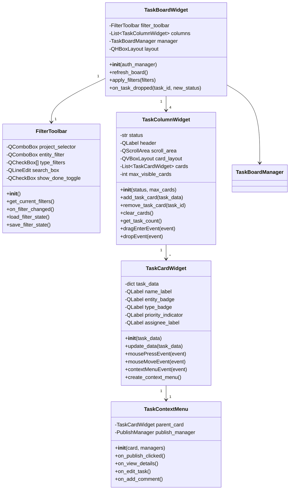

## Core Managers Class Structure

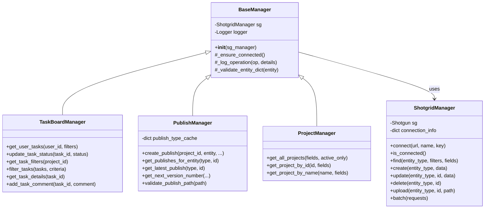

---

### `docs/diagrams/sequence_diagrams.md`

```markdown
# Sequence Diagrams

## User Opens Task Board

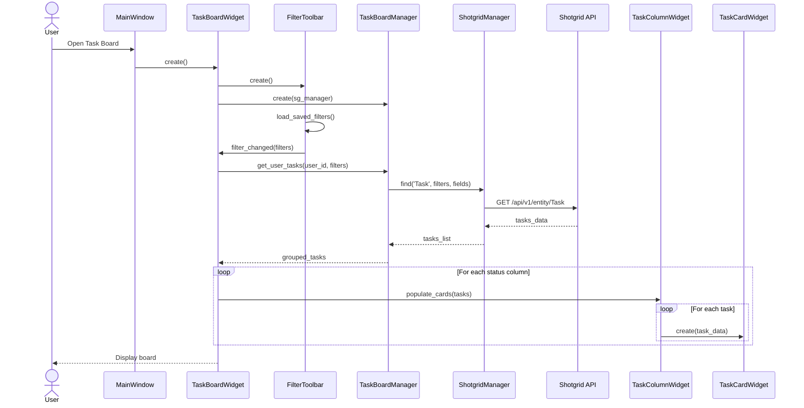

## Drag and Drop Task Between Columns

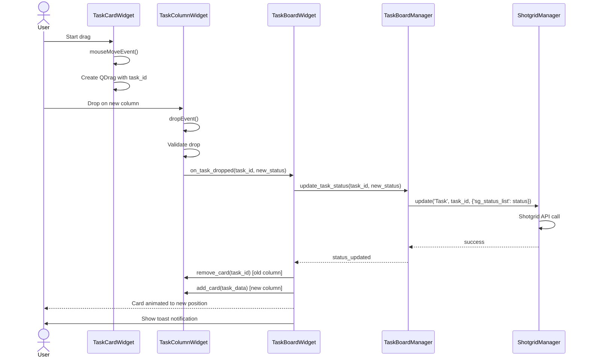

## Publish New Version from Task

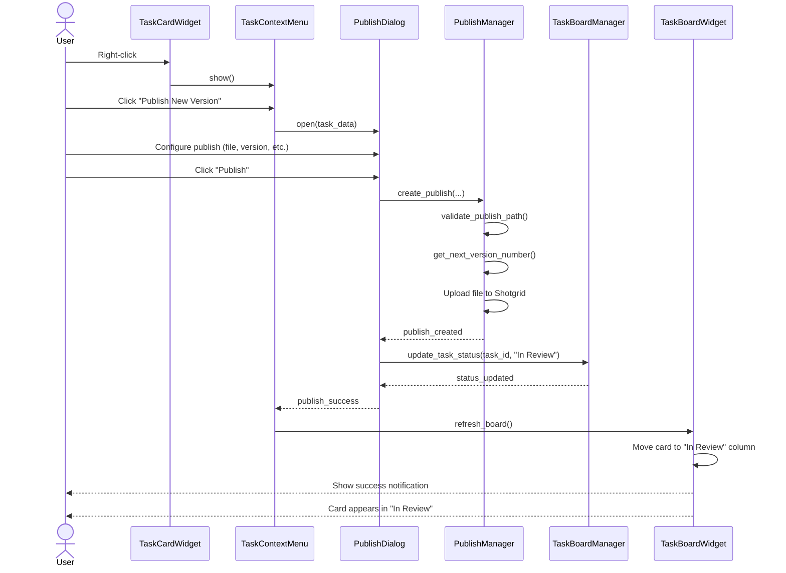

## Apply Filters

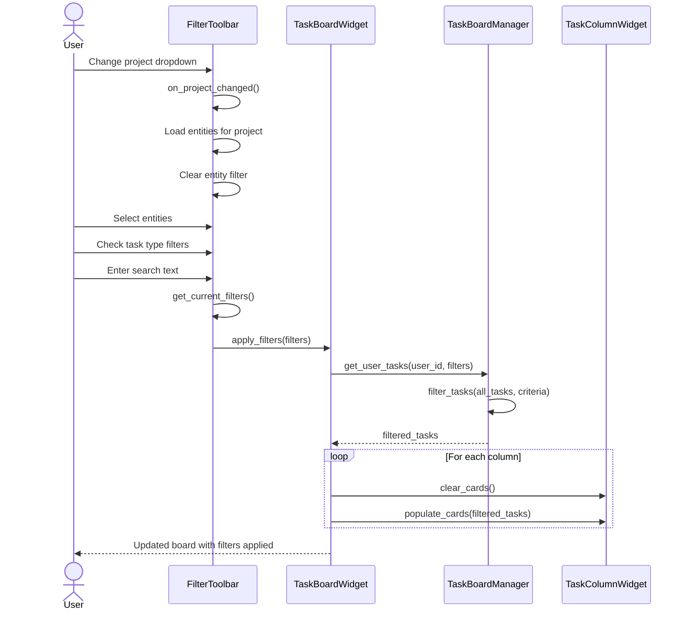

---

### `docs/diagrams/state_diagrams.md`

```markdown
# State Diagrams

## Task Status State Machine

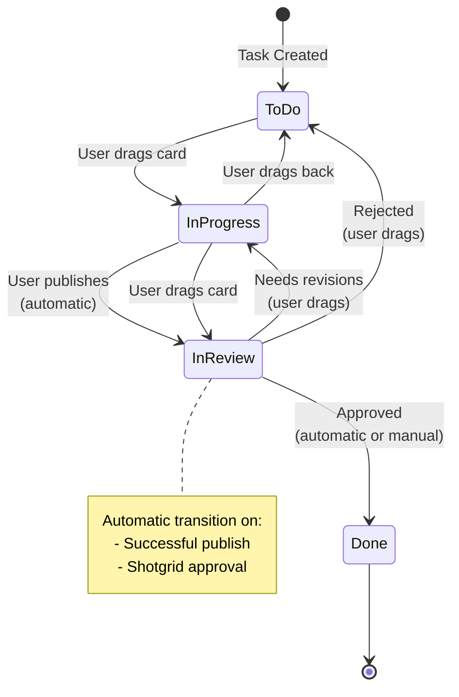

## Task Board UI State

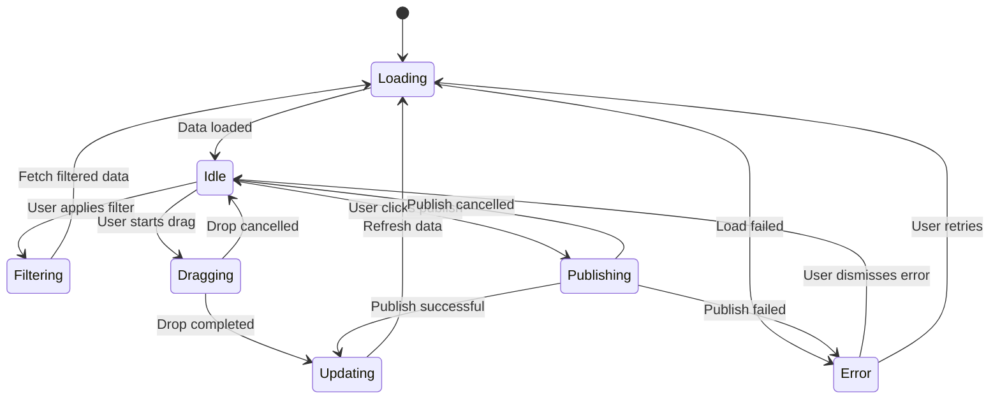

## Filter State Flow

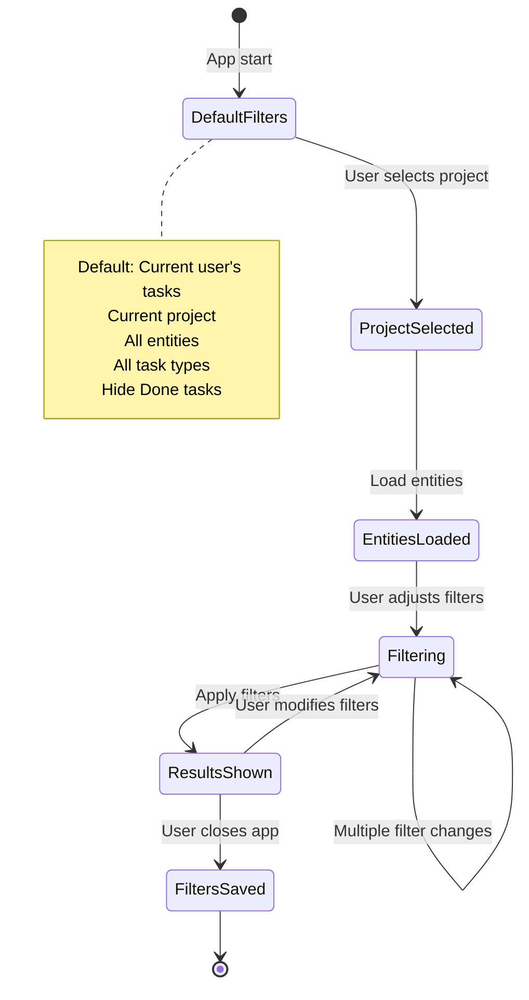

---

### `docs/diagrams/component_diagrams.md`

```markdown
# Component Diagrams

## Overall Application Architecture

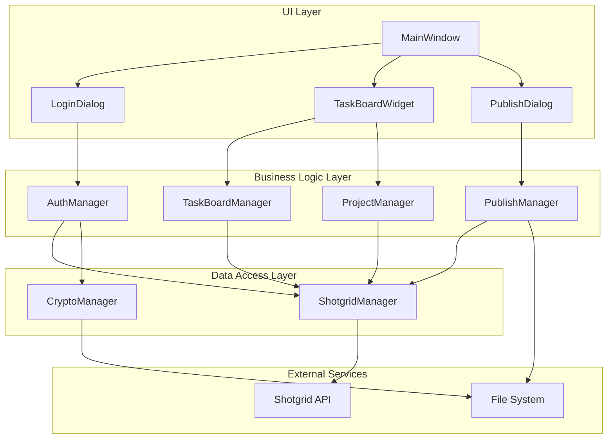

## Task Board Widget Component Structure

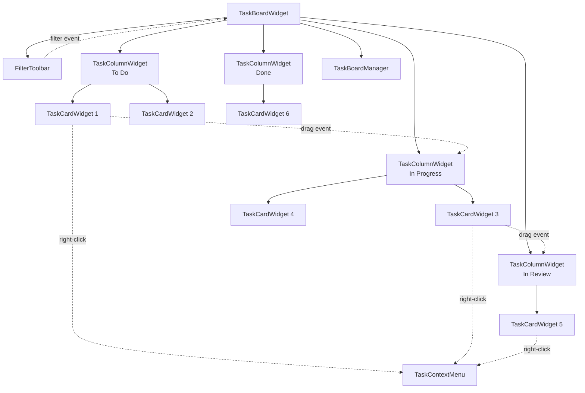

## Data Flow Architecture

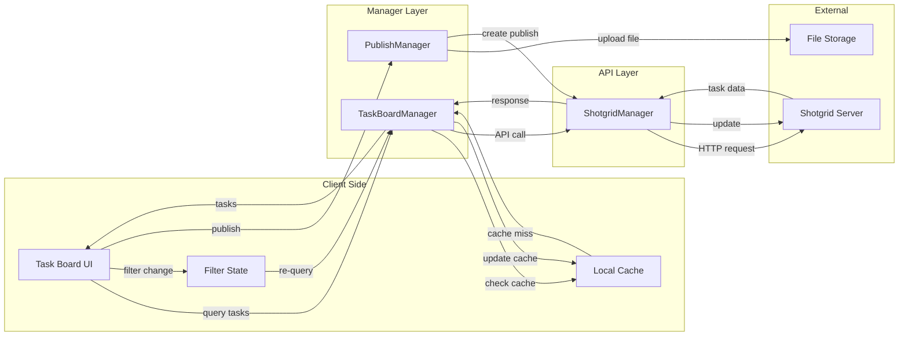

## Drag and Drop Flow

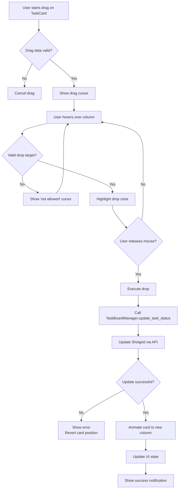

---

### `docs/diagrams/README.md`

```markdown
# Shotgrid Publisher - UML Diagrams

This directory contains UML diagrams for the Shotgrid Publisher application, created using Mermaid syntax.

## Viewing Diagrams

### GitHub/GitLab
Diagrams render automatically when viewing markdown files.

### VS Code
1. Install extension: "Markdown Preview Mermaid Support"
2. Open any `.md` file
3. Press `Ctrl+Shift+V` (Windows/Linux) or `Cmd+Shift+V` (Mac)

### Online Editor
Visit [Mermaid Live Editor](https://mermaid.live/) and paste diagram code.

### Sphinx Documentation
Diagrams are automatically rendered in the built documentation.

## Diagram Types

### Class Diagrams (`class_diagrams.md`)
- Widget hierarchy
- Manager class structure
- Inheritance relationships
- Dependencies

### Sequence Diagrams (`sequence_diagrams.md`)
- User interaction flows
- Inter-component communication
- API call sequences
- Event handling

### State Diagrams (`state_diagrams.md`)
- Task status transitions
- UI state management
- Filter state flow

### Component Diagrams (`component_diagrams.md`)
- System architecture
- Component relationships
- Data flow
- Layer structure

## Updating Diagrams

When modifying code structure:
1. Update relevant diagram file
2. Verify rendering in preview
3. Commit changes with code

## Mermaid Syntax Reference

- [Official Documentation](https://mermaid.js.org/)
- [Class Diagrams](https://mermaid.js.org/syntax/classDiagram.html)
- [Sequence Diagrams](https://mermaid.js.org/syntax/sequenceDiagram.html)
- [State Diagrams](https://mermaid.js.org/syntax/stateDiagram.html)
- [Flowcharts](https://mermaid.js.org/syntax/flowchart.html)
```

---

## Using Diagrams in Development

### During Planning
- Review class diagrams before implementation
- Use sequence diagrams to understand flow
- Reference state diagrams for logic

### During Implementation
- Keep diagrams open as reference
- Update diagrams as code evolves
- Use for code review discussions

### During Documentation
- Include diagram links in code comments
- Reference in PR descriptions
- Use in technical design documents

### Example Code Comment:
```python
class TaskBoardWidget(QWidget):
    """
    Main task board container widget.
    
    See class diagram: docs/diagrams/class_diagrams.md#task-board-widget-hierarchy
    See sequence: docs/diagrams/sequence_diagrams.md#user-opens-task-board
    """
    pass
```
```